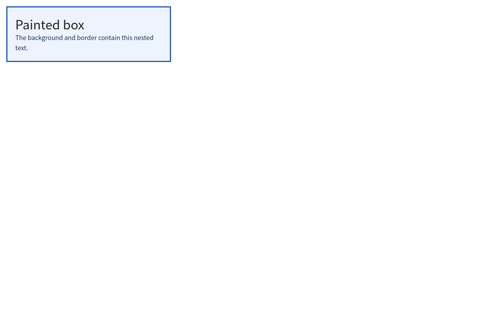

# Archetype Quick Browser

<!-- repo-languages:start -->
[English](README.md) | 简体中文
<!-- repo-languages:end -->

[](https://www.rust-lang.org/)
[](https://www.gpui.rs/)
[](https://github.com/shenzhepei/archetype-quick-browser/actions/workflows/ci.yml)

<!-- repo-badges:start -->
[](https://codecov.io/gh/shenzhepei/archetype-quick-browser)
[](https://github.com/shenzhepei/archetype-quick-browser/blob/HEAD/LICENSE)
[](https://github.com/sponsors/shenzhepei)
<!-- repo-badges:end -->

Archetype Quick Browser 是一个面向静态 HTML 文档的开发者预览版桌面浏览器。其 Rust
工作区提供基于 GPUI/gpui-component 的桌面外壳、经 broker 管理的 Renderer Runtime、
加密 Cookie 配置、基础表单、Flexbox、标签休眠、受限的本地与 HTTP(S) 加载以及 PNG/JPEG 显示。
V5 还提供不绑定执行器的 Rust SDK 和自有 RGBA 帧。

> [!NOTE]
> 本项目是用于开发和实验的浏览器引擎原型，并非生产级 Web 浏览器。当前桌面应用和 CI
> 以 macOS 为目标平台。



_来自仓库内 V3 固定测试语料的 Archetype 确定性渲染预览。_

## 功能

- 桌面标签页、空间、嵌套书签和持久化导航历史。
- HTML5 解析以及初步的 CSS 解析、层叠、样式、布局和绘制流水线。
- 受限的本地与 HTTP(S) 资源加载，并提供 TLS、解析和渲染分类错误页面。
- PNG 和 JPEG 解码、递归块布局、行内文本、边框与背景。
- 基于 SQLite 的浏览器状态持久化，并支持损坏配置恢复。
- 可取消的后台导航、各标签页独立的渲染页面，以及当前标签自动保持可见的溢出滚动。
- 由 Browser broker 管理的 GET/POST 会话、加密持久 Cookie 和基础交互表单。
- 带有界 IPC、崩溃恢复、macOS 沙箱探针和纯元数据标签休眠的 Renderer Runtime。
- Flexbox 方向、换行、对齐、增长、收缩和间距。
- V6 自定义属性、宽度媒体查询、Flex item basis/order、relative/absolute 定位和基础 z-index。
- `archetype-sdk 0.1` Engine/Page API、Runtime 生命周期、结构化事件、完整性校验和 RGBA8 帧。

## 运行

安装 `rust-toolchain.toml` 声明的 Rust 工具链，然后运行：

```bash
cargo run -p arch-browser
```

桌面应用会将配置存储在平台的应用支持目录中。新页面默认打开第一个确定性测试页面。
桌面外壳跟随操作系统语言：中文语言环境（`zh*`）使用中文，其余语言环境回退到英文。
如需在不打开窗口的情况下通过渲染流水线检查页面，请运行：

```bash
cargo run -p arch-browser -- --inspect fixtures/pages/05-image/index.html
```

应用会将换行分隔的 JSON 诊断日志写入
`<应用支持目录>/Archetype/logs/archetype.jsonl`。日志仅保存在本地，应用不会收集或上传遥测。
开发或测试时可设置 `ARCHETYPE_DATA_DIR`，将配置与日志隔离到指定目录。
`cargo run` 在终端输出的构建信息来自 Cargo，直接启动打包二进制时不会出现；应用自身的本地
诊断日志在开发构建和发布构建中都会按设计保留。

## 验证

```bash
cargo fmt --all -- --check
cargo clippy --workspace --all-targets -- -D warnings
cargo test --workspace
```

工作区测试会将全部 50 个金样渲染结果与仓库内固定的 `1280x800` PNG 参考图比较。
确认渲染变化符合预期后，可使用以下命令重新生成并审查参考图：

```bash
cargo run -p arch-browser --example update_snapshots
```

重启恢复集成测试会强制终止独立的浏览器配置进程，再验证空间、分层书签、标签页、标题、顺序和
选中项均可恢复。CI 会对 HTML、CSS 和版本化协议执行模糊测试。如需在本地复现，请安装 Rust nightly
和 [`cargo-fuzz`](https://github.com/rust-fuzz/cargo-fuzz)，然后运行：

```bash
cargo +nightly fuzz run html -- -max_total_time=20 -timeout=5
cargo +nightly fuzz run css -- -max_total_time=20 -timeout=5
cargo +nightly fuzz run protocol -- -max_total_time=20 -timeout=5
```

如需复现 V3 的启动、性能、内存和一分钟资源趋势证据，请构建全部 release 二进制并运行：

```bash
cargo build --release --bins
./target/release/arch-v3-acceptance \
  --duration-seconds 60 \
  --cycle-delay-milliseconds 1000 \
  --startup-samples 20 \
  --output docs/v3-acceptance-report.json
```

如需生成与 CI 上传内容相同的 LCOV 报告，请安装
[`cargo-llvm-cov`](https://github.com/taiki-e/cargo-llvm-cov) 并运行：

```bash
mkdir -p coverage
cargo llvm-cov --workspace --lcov --output-path coverage/lcov.info
```

`V4 Acceptance` 工作流现在会运行当前 72 页版本的一分钟趋势探针，并同时执行 Runtime 恢复、沙箱、
entitlement、支持矩阵和工作区质量闸门。

`V6 Acceptance` 工作流将确定性语料扩展到 62 页，并验证多视口响应式样式、定位、
Runtime/SDK 链路以及同一套一分钟 CPU/RSS 趋势闸门。

`V7 Acceptance` 工作流将语料扩展到 72 页，并验证有界 Grid 轨道、行优先放置、圆角、透明度、
单层外阴影、文本装饰，以及相同的 Runtime/SDK 和一分钟资源闸门。

运行 V5 UI 框架无关的合作方示例：

```bash
cargo build -p archetype-runtime --bin archetype-runtime
cargo run -p archetype-sdk --example partner_render -- \
  target/debug/archetype-runtime artifacts/sdk-partner.png
```

## 架构

工作区按浏览器职责拆分为多个专用 crate：

| Crate | 职责 |
| --- | --- |
| `archetype-types`、`archetype-protocol` | 稳定值对象、分帧 IPC、协商、路由和有界 transport |
| `archetype-sdk`、`archetype-raster` | UI 无关异步客户端、Runtime 生命周期、自有 RGBA 帧和确定性栅格 |
| `archetype-runtime` | 静态文档 Renderer 子进程与分帧命令循环 |
| `arch-browser` | 桌面外壳、编排、本地化和渲染集成 |
| `arch-html`、`arch-dom` | HTML 解析和文档表示 |
| `arch-css`、`arch-style` | CSS 解析、层叠和计算样式 |
| `arch-layout`、`arch-paint` | 布局和显示列表生成 |
| `arch-net` | 受限的文档与资源加载 |
| `arch-session`、`arch-store` | 导航状态和 SQLite 持久化 |

范围明确的产品需求和详细实现方案位于：

- [`docs/prd/03-Archetype-V3-PRD.md`](docs/prd/03-Archetype-V3-PRD.md)
- [`docs/detailed-design/03-Archetype-V3-详设.md`](docs/detailed-design/03-Archetype-V3-详设.md)
- [`docs/prd/05-Archetype-V4-安全运行时-PRD.md`](docs/prd/05-Archetype-V4-安全运行时-PRD.md)
- [`docs/detailed-design/05-Archetype-V4-安全运行时详设.md`](docs/detailed-design/05-Archetype-V4-安全运行时详设.md)
- [`docs/v3-acceptance.md`](docs/v3-acceptance.md) 及其
  [机器可读报告](docs/v3-acceptance-report.json)
- [`docs/v4-acceptance.md`](docs/v4-acceptance.md)、对应的[机器可读资源报告](docs/v4-acceptance-report.json)
  和机器可读的 [HTML/CSS 支持矩阵](docs/html-css-support.json)
- [`docs/prd/06-Archetype-V5-Rust-SDK预览-PRD.md`](docs/prd/06-Archetype-V5-Rust-SDK预览-PRD.md)、
  对应的[详细设计](docs/detailed-design/06-Archetype-V5-Rust-SDK预览详设.md)、
  [验收证据](docs/v5-acceptance.md)和[兼容矩阵](docs/sdk-compatibility.json)
- [`docs/prd/07-Archetype-V6-静态响应式CSS-PRD.md`](docs/prd/07-Archetype-V6-静态响应式CSS-PRD.md)、
  对应的[详细设计](docs/detailed-design/07-Archetype-V6-静态响应式CSS详设.md)和
  [验收证据](docs/v6-acceptance.md)，以及[机器可读资源报告](docs/v6-acceptance-report.json)
- [`docs/prd/08-Archetype-V7-Grid与视觉CSS-PRD.md`](docs/prd/08-Archetype-V7-Grid与视觉CSS-PRD.md)、
  对应的[详细设计](docs/detailed-design/08-Archetype-V7-Grid与视觉CSS详设.md)和
  [验收证据](docs/v7-acceptance.md)

## V3 状态

- V3 已完成：工作区和 CI；带标题栏标签页、紧凑型空间切换和按空间管理根书签的桌面外壳；
  DOM 与 HTML 解析；初步的 CSS 解析器和层叠；递归块盒与行内文本；支持定位文本、图片、
  背景和边框的可序列化显示列表；文本颜色、字体族、字重、样式、对齐、行高、空白处理和
  溢出裁剪；受限的文档、样式表、PNG 与 JPEG 加载和图片回退；分类错误页面；支持损坏配置恢复的 SQLite
  空间与页面持久化；不含遥测的本地结构化 JSONL 诊断日志；
  全局标签页持久化、分层空间书签存储和根书签栏、导航标识、重定向、
  链接与历史；30 个确定性测试页面全部完成，并通过全语料断言验证标题、绘制文本、
  解析后的链接、已加载图片和预期诊断；固定 PNG 截图回归达到 V3 的 0.5% 像素差异阈值。
  强制退出后的配置恢复、HTML/CSS 解析器入口的 CI 模糊测试、可取消后台导航、标签页独立
  渲染状态，以及已记录的启动、页面流水线、帧、CPU 和 RSS 趋势证据也已完成。
- 每项验收要求的证据和已知限制维护在 [`docs/v3-acceptance.md`](docs/v3-acceptance.md)。
  JavaScript、表单、媒体、Flexbox、Grid、多进程渲染、沙箱和公开签名分发仍不属于 V3 范围。

## V4 状态

- V4 已完成：稳定 ID 和版本化有界 IPC；带认证的 Renderer Runtime 监督；Browser 所有的文件、
  网络、Cookie、GET 与 POST broker；100 轮子进程终止恢复；macOS 开发沙箱与签名 entitlement
  探针；加密持久 Cookie 配置；基础交互表单；Flexbox；只含元数据的干净标签休眠；以及 50 个
  确定性截图金样。
- Release 工作流会打包两个必需二进制、SHA-256 校验和、验收证据、许可证和机器可读支持矩阵。
  其产物未签名、未公证，属于开发者预览而非面向公众的生产发行。
- JavaScript、Grid、媒体、完整表单、公开 SDK 兼容、生产签名、公证和自动更新仍不属于 V4 范围。

## V5 状态

- V5 已完成：`archetype-sdk 0.1.0` 可启动并认证 Runtime `0.5.x`、创建独立页面、校验有界
  同源输入、拒绝旧导航结果、发布结构化事件，并在不暴露 GPUI、DOM、布局、DisplayList 或协议
  类型的前提下返回紧密排列且由 SDK 持有的 RGBA8 帧。
- 合作方示例可将英文、中文和 Flexbox 内容渲染为 PNG。SDK 故障测试覆盖正确/错误 Runtime
  SHA-256、优雅关闭、断连事件、事件压力和 100 次终止/重启/再渲染。
- V5 仍是 Apple Silicon macOS 开发者预览。SDK 1.0、JavaScript、Runtime 自主管理网络、生产
  签名、公证、Windows、Linux、共享内存帧和 GPU 句柄均未实现。

## V6 状态

- V6 已完成：继承的自定义属性和有界 `var()` fallback 展开、`screen`/`all` 的 min/max-width
  媒体查询、Flex `basis`/`order`、relative/absolute 定位、百分比偏移和稳定的基础 z-index 绘制。
- 确定性语料现有 62 页。Browser、Runtime 和 SDK 使用调用方实际视口宽度；Protocol v4.1
  还传递视口高度，用于定位元素的初始包含块。
- Grid、fixed/sticky 定位、通用媒体查询、transition、animation 和 GPU 合成仍不支持，
  并在机器可读支持矩阵中单独标记。

## V7 状态

- V7 已完成：有界的固定、百分比、`fr` 和 `repeat()` Grid 列及行优先放置；独立行列间距；
  颜色型 `background` 简写；圆角；元素透明度；单层有界外阴影；下划线和删除线文本装饰。
- 确定性语料现有 72 页，其中新增 10 页 V7 金样。重新生成语料后，原 62 张参考图保持不变。
- [V7 一分钟验收报告](docs/v7-acceptance-report.json)完成 4,248 次页面加载；后半段每页 CPU
  成本为前半段的 99.47%，RSS 增长 384 KiB。
- 高级 Grid 放置、span、`minmax()`、subgrid、多层/inset 阴影、渐变、transition、animation、
  JavaScript 和 GPU 合成仍不支持。

## 许可证

本项目采用 [Apache License 2.0](LICENSE) 许可。第三方归属信息见
[THIRD_PARTY_NOTICES.md](THIRD_PARTY_NOTICES.md)。
