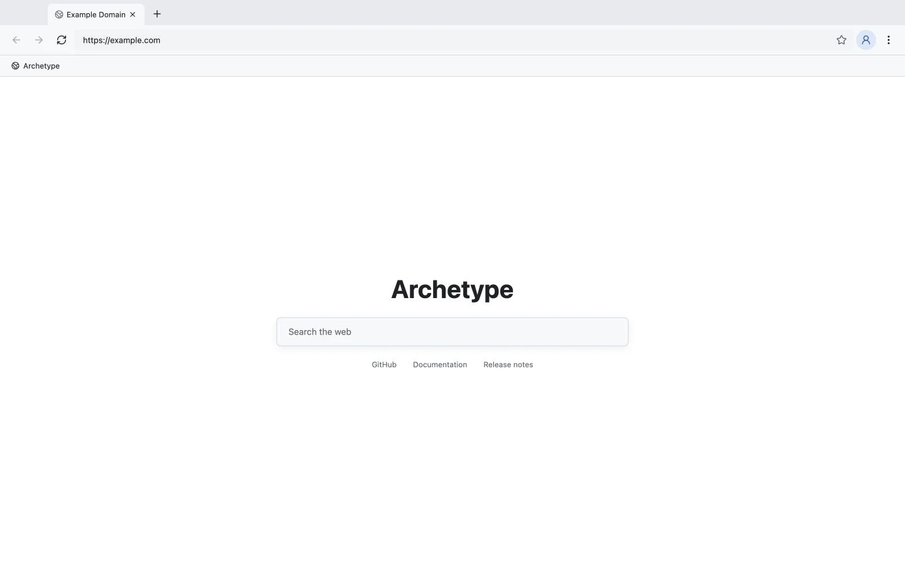

# Archetype Runtime Browser

<!-- repo-languages:start -->
[English](README.md) | 简体中文
<!-- repo-languages:end -->

<!-- repo-badges:start -->
[](https://nodejs.org)
[](https://pnpm.io)
[](https://vite.dev)
[](https://www.typescriptlang.org)
[](https://sass-lang.com)
[](https://codecov.io/gh/shenzhepei/archetype-runtime-browser)
[](https://github.com/shenzhepei/archetype-runtime-browser/blob/HEAD/LICENSE)
[](https://github.com/sponsors/shenzhepei)
<!-- repo-badges:end -->

Archetype Runtime Browser 让顶层 HTTPS 应用通过 `navigator.archetype` 调用可信、自托管的 Node.js 云函数。数据库凭证、OIDC Token、设备证明、队列和事务逻辑都不会进入网站 JavaScript。

[阅读文档](https://shenzhepei.github.io/archetype-runtime-browser/) · [下载发行版](https://github.com/shenzhepei/archetype-runtime-browser/releases)



## 包含内容

- Electron/Chromium 浏览器，支持多标签、导航、站点权限、Runtime 状态、主题，以及持久化的英文/简体中文界面。
- 仅向符合条件的顶层 HTTPS 与 localhost 页面提供冻结的 `navigator.archetype`。HTTP、文件页、内部页、iframe 和 Service Worker 均不注入。
- Docker 自托管 Gateway、隔离函数宿主、可靠 Worker、平台 PostgreSQL、示例 PostgreSQL/MySQL，以及可选 Caddy 边缘服务。
- 绑定 Origin 的设备密钥、OIDC Authorization Code + PKCE、60秒资源能力票据、签名调用证明、重放检测、审计，以及 AES-256-GCM 信封加密的数据库 Secret。
- PostgreSQL/MySQL 适配、事务 Outbox、带租约任务、fencing token、重试、死信和原子抢单示例。
- 部署 CLI，以及函数、Worker、协议和生成客户端的类型化包。

浏览器不接受网站发送的任意 SQL，也不向页面 JavaScript 暴露数据库 URL。最终权限仍由可信云函数、身份、事务和数据库约束共同执行。

## 快速开始

需要 Node.js 24、pnpm 10.33.2、Docker 和 Docker Compose。

```bash
corepack enable
pnpm install --frozen-lockfile
cp infra/docker/.env.example infra/docker/.env
pnpm docker:up
```

另开一个终端：

```bash
pnpm typecheck
pnpm test
pnpm dev
```

项目、Origin、数据库和部署配置请参阅[自托管指南](https://shenzhepei.github.io/archetype-runtime-browser/zh-CN/guide/self-hosting)与[抢单教程](https://shenzhepei.github.io/archetype-runtime-browser/zh-CN/guide/data-jobs)。

## 工作区

| 路径 | 职责 |
| --- | --- |
| `apps/browser` | Electron 浏览器外壳与页面 Runtime 桥接 |
| `apps/docs` | 英文和简体中文 VitePress 文档 |
| `services/gateway` | 发现、身份、策略、Secret、幂等、审计与路由 |
| `services/function-host` | 校验摘要的 Node.js 函数子进程 |
| `services/worker` | Outbox 分发、队列租约、重试与死信 |
| `packages/*` | 协议、SDK、适配器、类型化客户端与 CLI |
| `examples/order-claim` | PostgreSQL/MySQL 并发与 Worker 示例 |
| `infra/docker` | 自托管 Runtime 镜像与 Compose 栈 |

[产品需求](docs/prd/02-Archetype-Runtime-PRD.md)与[详细设计](docs/detailed-design/02-Archetype-Runtime-Design.md)定义了安全和执行边界。

## 构建与发布

```bash
pnpm test:coverage
pnpm build
pnpm package:mac
```

`v1.0.0` 这类语义化 Tag 会生成 Windows x64 NSIS 安装器，以及 macOS arm64/x64 DMG 和 ZIP。首版安装包未签名且未公证，因此 Windows SmartScreen 或 macOS Gatekeeper 可能提示发布者未知。本项目不提供绕过操作系统安全控制的脚本。

## 许可证

本项目采用 [Apache License 2.0](LICENSE) 许可。
