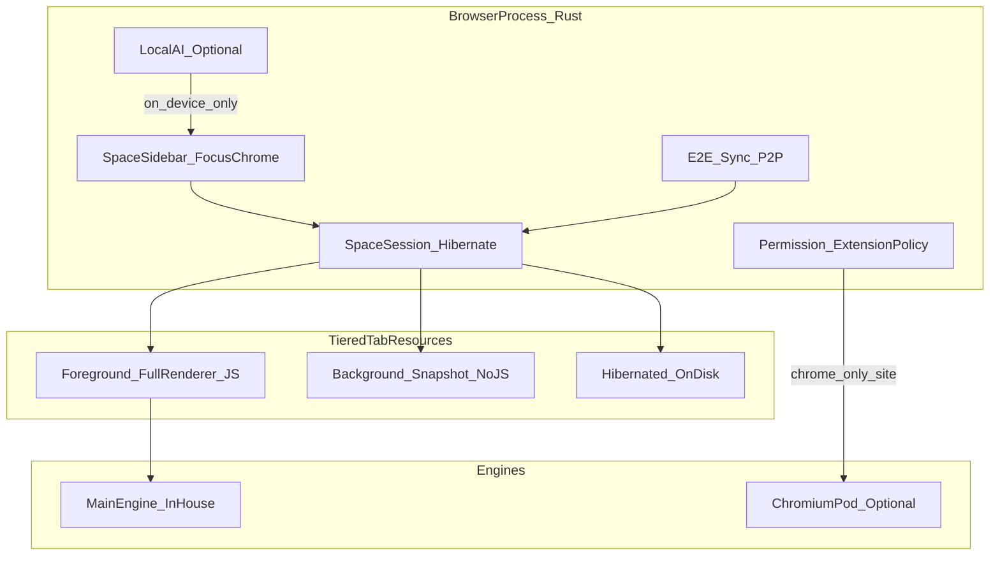
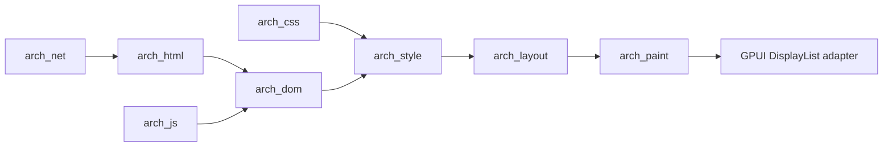

# Archetype 总体详细设计

| 项 | 内容 |
|----|------|
| 规范号 | 01 |
| 对应 PRD | [../prd/01-Archetype-PRD.md](../prd/01-Archetype-PRD.md) |
| 版本 | 0.1 |
| 日期 | 2026-08-13 |

---

## 1. 设计目标与约束

| 目标 | 约束 |
|------|------|
| 全自研主渲染管线 | 主路径不嵌入 Chromium/Gecko/Servo/系统 WebView |
| Space + 三级资源 | 快照格式自有，后台默认无 JS |
| 可商用、许可干净 | 依赖白名单：MIT/Apache/BSD；解析可选用 MPL crate（档 A） |
| 小团队可推进 | 能力切片；公开支持矩阵；可选 Pod 兜底 Chrome-only |

---

## 2. 逻辑架构



**进程原则：**

- Browser 进程：UI、Space、权限、扩展宿主、网络策略、同步  
- Renderer：按站（eTLD+1）隔离；**不等于每标签一进程**  
- 同时前台页默认限制为 1（可配置）  
- GPU：初期通过 GPUI Metal 后端同进程呈现；稳定后再拆

---

## 3. 全自研引擎管线



### 3.1 模块职责

| Crate | 职责 | 实现策略 |
|-------|------|----------|
| arch-browser | GPUI 壳：Space、地址栏、权限 UX、DisplayList 展示 | 自研 + GPUI/gpui-component |
| arch-session | Foreground/Background/Hibernated | 自研状态机 + 版本化快照 |
| arch-net | HTTP(S)、重定向、Cookie | hyper + rustls + tokio |
| arch-html | 字节 → DOM | 档 A：html5ever；档 B：自写 |
| arch-css | 样式表/选择器 | 档 A：cssparser/selectors；档 B：自写 |
| arch-dom | 节点树、基础遍历 | 自研 |
| arch-style | 级联、继承、指定值 | **自研（核心）** |
| arch-layout | 块/行内/简单 flex、滚动 | **自研（核心 IP）** |
| arch-paint | DisplayList、图层 | **自研** |
| arch-gfx | 后续独立 GPU 呈现与文字层 | V3 不创建；后续从 GPUI 适配层拆分 |
| arch-js | 最小 DOM 绑定 | QuickJS 或 Boa（不自研 JIT） |
| arch-policy | 扩展与会话权限 | 自研（见扩展详设） |
| arch-sync | E2E 同步 | SQLite + AEAD/age |
| arch-pod | 可选 Chromium 舱 | CEF/官方构建，严格隔离 |
| arch-ipc | 进程通信 | 自研 + serde |

### 3.2 纯度两档

| 档 | HTML/CSS 解析 | 说明 |
|----|---------------|------|
| **A（默认）** | html5ever / cssparser（MPL） | 改这些文件需 MPL 源码义务；布局绘制仍自有 |
| **B** | 解析全自写 | 零 MPL；工期更长 |

### 3.3 刻意不自研

TLS、完整 Unicode 库、JPEG/PNG 解码、HarfBuzz/FreeType、V8 级 JS 引擎。

---

## 4. 三级资源状态机

### 4.1 状态

```text
Foreground --(失焦超时/切走)--> Background --(内存压力/关 Space/手动)--> Hibernated
Hibernated --(用户打开)--> Foreground   # hydrate；失败则冷加载 URL
Background --(用户切回)--> Foreground
```

### 4.2 快照内容（Background / Hibernated）

**必须：** URL、标题、滚动位置、基本表单态、DOM 序列化或可重建所需数据、样式关联版本号  

**禁止保留：** JS 堆、定时器、WebSocket、扩展注入状态  

**失败降级：** 丢快照，保留 Space 元数据，按 URL 冷启动  

### 4.3 存储映射

| 数据 | 介质 |
|------|------|
| Space / 页面列表 / 统计 | SQLite（rusqlite） |
| 休眠大对象 | 内容寻址文件（hash 文件名）；DB 存指针 |
| 密码 / 同步密钥 | 加密库 + 系统钥匙串 |
| 扩展包 | 独立目录 + 签名元数据 |

---

## 5. UI 壳

| 项 | 选型 | 备注 |
|----|------|------|
| 框架 | GPUI + gpui-component | Apache-2.0；排除未付费 Slint-GPL |
| 信息架构 | 左 Space，内垂直页列表 | 非 Chrome 顶栏标签海 |
| 内容区 | DisplayList 适配为 GPUI 元素 | Phase 0 可用自绘金样占位，**不**接系统 WebView |
| 内部页 | 设置/权限/扩展管理 | 使用 GPUI/gpui-component 或引擎约简页 |

---

## 6. 兼容舱（可选）

| 规则 | 说明 |
|------|------|
| 触发 | 用户标记 / 兼容列表 / 后期启发式 |
| 隔离 | 独立进程；独立会话存储 |
| 禁止 | 扩展、写入主配置、持久 Cookie/历史 |
| 生命周期 | 关闭即焚 |

主引擎与 Pod **数据不互通**（除用户显式「在舱中打开此 URL」）。

---

## 7. 安全基线

- Renderer 无原始套接字/文件系统；网络经 Browser  
- 站点权限默认拒绝 + 会话授权  
- 扩展见 [02-Archetype-扩展系统详设.md](./02-Archetype-扩展系统详设.md)  
- 证书错误硬失败；混合内容策略分期  
- 崩溃上报默认关，上传需明示同意  

---

## 8. 本地 AI（可选模块）

- 独立 crate `arch-ai`；默认不链进安装包权重  
- 推理：llama.cpp（MIT）或 candle  
- 输入输出仅本地；云端插件默认关  
- 模型权重许可证单独合规页  

---

## 9. 仓库结构

```text
quick-browser/
  crates/
    arch-browser/
    arch-session/
    arch-net/
    arch-html/
    arch-css/
    arch-dom/
    arch-style/
    arch-layout/
    arch-paint/
    arch-gfx/
    arch-js/
    arch-policy/
    arch-sync/
    arch-pod/
    arch-ai/
    arch-ipc/
  fixtures/                 # 金样 HTML + 期望截图
  docs/
    prd/
    detailed-design/
```

---

## 10. 工程阶段

| Phase | 周期（约） | 交付 |
|-------|------------|------|
| 0 | 2–4 周 | GPUI Space 壳 + SQLite；金样文本/简易盒占位 |
| 1 | 1–2 月 | net + HTML/CSS→DOM |
| 2 | 2–4 月 | 布局 + DisplayList + GPUI 展示；链接/滚动；截图回归 |
| 3 | 1–2 月 | 三级资源与 Space 打通；内存基准 |
| 4 | 3–6 月 | QuickJS/Boa 最小 DOM；阅读模式；一次性权限；统计/番茄钟 |
| 4b | 并行 | 扩展 Tier0/1；规则侧载 |
| 5 | 3–6 月 | E2E 同步；可选 Pod；可选 AI |

对照轨：同一金样在 Chrome/Servo 截图对比，**不链接进产品**。

Phase 0–2 的首个可实施切片以 [03-Archetype-V3-详设.md](./03-Archetype-V3-详设.md) 为准；范围冲突时，03 是 V3 的实施基线。

---

## 11. 质量闸门

- fixtures 金样 + 截图回归  
- 模糊测试：HTML/CSS 解析、IPC、规则编译  
- 内存剧本：N 个 Space 页 vs Chrome，内置测量面板  
- `THIRD_PARTY_NOTICES.md` 与 MPL 源码提供方式（若用档 A）  

---

## 12. 许可与依赖策略

```text
自研：style / layout / paint / session / policy / sync 策略
借用：GPUI, gpui-component, SQLite, hyper, rustls, HarfBuzz, QuickJS|Boa
可选：Chromium Pod
禁止主路径：Servo/Gecko/WebKit/系统 WebView 作为引擎
禁止默认：Slint-GPL、捆绑未审模型权重
```

商用：主产品可闭源收费；若修改并分发 MPL 文件则对这些文件履行 MPL 义务。

---

## 13. 相关文档

- PRD：[../prd/01-Archetype-PRD.md](../prd/01-Archetype-PRD.md)  
- 扩展详设：[./02-Archetype-扩展系统详设.md](./02-Archetype-扩展系统详设.md)  
- V3 详设：[./03-Archetype-V3-详设.md](./03-Archetype-V3-详设.md)  
