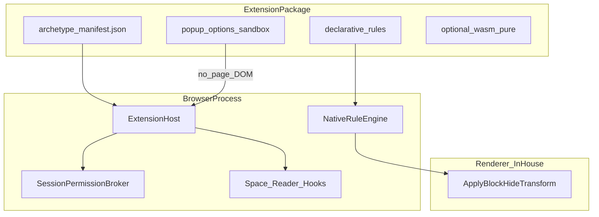

# Archetype 扩展系统详细设计

| 项 | 内容 |
|----|------|
| 规范号 | 02 |
| 对应 PRD | [../prd/02-Archetype-扩展系统-PRD.md](../prd/02-Archetype-扩展系统-PRD.md) |
| 版本 | 0.1 |
| 日期 | 2026-08-13 |

---

## 1. 目标与非目标

### 目标

- 提供可扩展的**声明式**能力（拦截、隐藏、主题、Space 模板等）  
- 威胁模型：扩展不可默认成为「页面内间谍」  
- 分发可侧载、可审计；后期可重现构建  

### 非目标

- 兼容 Chrome / Edge MV3（`chrome.*`、Content Script 任意 DOM）  
- 在 Chromium Pod 内安装扩展  
- 首年建设封闭应用商店  

---

## 2. 与 Chrome / Edge / Safari 对照

| 维度 | Chrome | Edge | Safari | Archetype |
|------|--------|------|--------|-----------|
| 模型 | MV3 + SW | ≈ Chrome | WebExt 子集 + App Store | **零信任声明式（ZTE）** |
| API | `chrome.*` | `chrome.*` | `browser.*` | 自有 manifest / Host API |
| DOM 注入 | Content Script 常态 | 同左 | 有限 | **默认禁止** |
| 拦网 | DNR | DNR | Content Blocker / 有限 DNR | 原生 RuleEngine 执行规则 |
| 后台 | Service Worker | 同左 | 受限 | **无常驻 SW** |
| 分发 | Web Store | Add-ons | App Store | 侧载 → 精选列表 |

**原则：** 扩展向浏览器提交意图与规则，不是住进网页的第二 OS。

---

## 3. 架构



| 组件 | 进程 | 职责 |
|------|------|------|
| ExtensionHost | Browser | 安装/校验/生命周期/弹 UI |
| NativeRuleEngine | Browser | 编译并下发规则；执行网络策略 |
| SessionPermissionBroker | Browser | 会话级敏感权限 |
| Renderer Apply | Renderer | 应用隐藏/变换；**无扩展代码** |
| 扩展 UI | 隔离源 `arch-extension://` | popup/options；无页面 DOM bridge |

---

## 4. 能力分档

### Tier 0 — 声明式（MVP）

| 权限/能力 | 说明 |
|-----------|------|
| netRules | block / https-upgrade / 有限 redirect（DNR 子集语义） |
| hideRules | 经引擎校验的 CSS 选择器隐藏 |
| newTab / omniboxKeyword | 白名单能力 |
| theme | 颜色/字体令牌 |
| spaceTemplate | 创建 Space 骨架（无远端代码） |

### Tier 1 — 隔离 UI 与纯计算

| 能力 | 说明 |
|------|------|
| popup / options | 仅扩展源页面；禁止 `executeScript` |
| storage.local | 扩展私有 KV，小配额 |
| pure wasm | 无网无盘；I/O 经 Host 拷贝 |

### Tier 2 — 敏感（默认关，会话授权）

| 能力 | 说明 |
|------|------|
| activeSpace.read | 当前 Space 标题/URL 列表，不含正文 |
| activeTab.url | 仅前台 URL；仅本次或 30 分钟 |
| bookmarks / exportHints | 需显式用户手势 |

### 永不提供（相对 Chrome）

- 任意 Content Script / 页面 DOM 读写  
- 全历史嗅探、`<all_urls>` 常驻  
- 默认 nativeMessaging、远程代码执行  

---

## 5. 清单与包格式

### 5.1 Manifest（示意）

```json
{
  "archetype_manifest_version": 1,
  "name": "Clean Reader Pack",
  "id": "vendor.clean-reader",
  "version": "1.0.0",
  "permissions": ["netRules", "hideRules"],
  "optional_permissions": ["activeTab.url"],
  "net_rules_file": "rules/net.json",
  "hide_rules_file": "rules/hide.json",
  "ui": { "options": "options.html" },
  "content_hash": "sha256-..."
}
```

### 5.2 包

- 扩展名：`.archx`（zip 类容器）或目录侧载  
- 签名：ed25519；设置页展示 content_hash  
- 禁止包外动态加载可执行脚本  

### 5.3 规则文件（语义级，实现期再钉 schema）

**net 规则示例字段：** `id`, `action` (`block`|`upgrade`), `url_filter`, `resource_types`, `priority`  

**hide 规则示例字段：** `id`, `selectors[]`, `domains[]`（可选）  

引擎侧对选择器做复杂度限制（禁极端万能匹配滥用）。

---

## 6. 权限 UX

| 事件 | 行为 |
|------|------|
| 安装 | 仅授予声明的 Tier0 静态权限；展示规则类型摘要 |
| 敏感 API 首次调用 | 模态：仅本次 / 30 分钟 / 拒绝 |
| Space 切换 | 可配置权限不跨 Space 继承 |
| 页入 Background/Hibernate | 扩展不因此被唤醒 |

---

## 7. 规则执行路径

1. ExtHost 读入规则 JSON → 校验  
2. RuleEngine 编译为内部 `CompiledRuleSet`（版本号）  
3. net：在 arch-net 请求管线挂钩（block/upgrade）  
4. hide：随导航下发 Renderer；在样式/绘制前应用  
5. 扩展更新 → 原子替换 RuleSet；失败回滚  

**EasyList 等：** 提供官方转换器 → 内部 net/hide 子集；转换失败规则丢弃并记日志。

---

## 8. 分发阶段

| 阶段 | 做法 |
|------|------|
| 4a | 本地侧载 + 签名校验 |
| 4b | 精选列表（URL 索引 + 构建说明） |
| 后期 | 可重现构建 + 社区审计 |

---

## 9. 与实现模块映射

| 模块 | 工作 |
|------|------|
| arch-policy | manifest、签名、权限经纪、规则编译 |
| arch-net | netRules 挂钩 |
| arch-layout / arch-paint | hideRules / 阅读变换 |
| arch-browser | 安装 UI、权限框、popup 容器 |
| arch-pod | **强制零扩展** |

---

## 10. 测试要点

- 恶意 manifest / 超大规则集 / 危险选择器 → 拒绝或降级  
- 扩展 UI 无法 `postMessage` 到页面原点  
- Pod 进程检测扩展加载 → 启动失败或剥离  
- 权限到期后 API 立即失败  
- 规则热更新无竞态（用版本号）  

---

## 11. 里程碑

| 次序 | 交付 |
|------|------|
| M1 | Tier0 net+hide + `.archx` 侧载 |
| M2 | Tier1 popup/options/storage |
| M3 | EasyList 子集导入 |
| M4 | Tier2 会话权限 + 精选列表 |

---

## 12. 相关文档

- [总体详设](./01-Archetype-总体详设.md)  
- [PRD](../prd/02-Archetype-扩展系统-PRD.md)  
