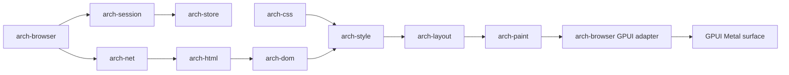

# Archetype V3 详细设计

| 项 | 内容 |
|----|------|
| 规范号 | 03 |
| 对应 PRD | [../prd/03-Archetype-V3-PRD.md](../prd/03-Archetype-V3-PRD.md) |
| 版本 | V3 开发者预览版 |
| 状态 | 可实施基线 |
| 日期 | 2026-08-13 |

---

## 1. 实施原则

- 先验证完整渲染链路，不并行铺开总体架构中的全部 crate。
- V3 只处理可信金样和普通静态页面，不建立虚假的通用浏览器安全承诺。
- 固定依赖和接口边界；后续用独立进程替换执行位置时，不改动上层文档模型。
- 不支持的能力必须显式降级、记录诊断且保持稳定。
- V3 完成条件以自动化验收为准，不以模块“已编码”为准。

## 2. 已冻结决策

| 决策 | V3 选择 | 原因 |
|------|---------|------|
| 平台 | macOS 14+、Apple Silicon | 收窄窗口、字体和发布变量 |
| 语言 | Rust stable，锁定 `rust-toolchain.toml` | 与总体架构一致 |
| UI | GPUI + gpui-component | 使用原生 GPU UI、成熟组件和主题系统 |
| GPU | GPUI Metal 后端，同进程渲染 | 先验证显示链路，V4 再拆进程 |
| HTML 解析 | html5ever | 避免首版自研容错解析器 |
| CSS 解析 | cssparser + selectors | 聚焦自研级联、布局和绘制 |
| 网络 | hyper + rustls + tokio | 使用成熟网络与 TLS 实现 |
| 字体 | 系统字体 + HarfBuzz 兼容塑形层 | 支持中英文基础排版 |
| 图片 | 成熟 Rust PNG/JPEG 解码库 | 图片编解码不属于核心 IP |
| 存储 | SQLite + rusqlite | 支持迁移和事务 |
| JavaScript | 不集成 | V3 页面模型保持静态 |
| 进程 | 单进程开发者预览 | V3 不处理不可信主动内容 |

依赖版本必须通过 Cargo lockfile 固定。引入依赖前记录许可证，MPL 依赖不得复制或修改源码，若发生修改则同步准备源码提供义务。

## 3. V3 架构



### 3.1 V3 crate 集合

| Crate | V3 职责 | 不负责 |
|-------|---------|--------|
| `arch-browser` | GPUI 窗口、顶部标签页、紧凑 Space 切换、书签入口、地址栏、导航命令、错误页、DisplayList 展示 | 网页排版规则 |
| `arch-session` | 全局标签页、导航历史、选中状态 | DOM 快照、JS 冻结 |
| `arch-store` | SQLite schema、事务、迁移 | 页面正文缓存 |
| `arch-net` | GET、重定向、超时、响应体限制 | Cookie、认证、下载 |
| `arch-html` | html5ever 适配为内部 DOM | 自研 tokenizer/parser |
| `arch-css` | 解析样式表与选择器 | 完整 CSS 语法支持 |
| `arch-dom` | 只读文档树、属性、文本节点 | DOM mutation API |
| `arch-style` | 匹配、级联、继承、初始值 | 动画和伪元素 |
| `arch-layout` | 块、行内、文本换行、盒模型 | Flex/Grid/定位/浮动 |
| `arch-paint` | 背景、边框、文本、图片 DisplayList | 合成动画和滤镜 |

V3 不创建 `arch-js`、`arch-policy`、`arch-sync`、`arch-pod` 或 `arch-ai` 的占位实现。

V3 不单独创建 `arch-gfx` 占位 crate；`arch-browser` 将只读 DisplayList 适配为 GPUI 元素并使用 GPUI 滚动容器。后续拆分 Renderer/GPU 进程时，以 DisplayList 边界替换该适配层。

开发构建启用 GPUI `runtime_shaders`，避免依赖额外的 Xcode Metal Toolchain 组件；发布构建在性能基线阶段评估切换为预编译 Metal shader。

## 4. 稳定边界

### 4.1 文档管线

各阶段使用显式数据结构传递，不允许 UI 直接读取解析器内部类型：

```text
ResponseBytes -> ParsedDocument -> StyledTree -> LayoutTree -> DisplayList -> Frame
```

- 每个类型归其 crate 所有，只通过只读 ID 和公共值对象跨边界。
- DOM 节点使用文档内稳定 `NodeId`，不把裸指针传给其他模块。
- `DisplayList` 必须可序列化到测试快照，但 V3 不将其作为用户会话格式。
- 网络、解析、样式、布局错误统一转为带阶段和 URL 的诊断记录。

### 4.2 UI 与引擎命令

```rust
enum BrowserCommand {
    Navigate { page_id: PageId, url: Url },
    Back { page_id: PageId },
    Forward { page_id: PageId },
    Reload { page_id: PageId },
    Stop { page_id: PageId },
    Resize { page_id: PageId, viewport: Viewport },
    Scroll { page_id: PageId, delta_y: f32 },
}
```

引擎通过事件返回加载状态、标题、最终 URL、帧和错误。命令与事件必须带 `page_id` 和单调递增的 `navigation_id`，旧导航产生的异步结果必须丢弃。

## 5. 支持矩阵

### 5.1 HTML

| 类别 | V3 支持 |
|------|----------|
| 文档 | `html`、`head`、`title`、`meta charset`、`body` |
| 分区 | `main`、`article`、`section`、`header`、`footer`、`nav`、`div` |
| 文本 | `h1`–`h6`、`p`、`span`、`strong`、`em`、`br`、`pre`、`code` |
| 列表 | `ul`、`ol`、`li` |
| 媒体 | `img`，仅 PNG/JPEG |
| 导航 | `a[href]`，支持相对 URL |
| 资源 | `style`、同源 `link[rel=stylesheet]` |

其他元素保留其子内容并按 `display: inline` 或 `block` 的默认映射降级；`script`、`iframe`、`object` 及事件属性不执行。

### 5.2 CSS

V3 支持：

- 类型、类、ID、后代和子选择器，以及简单选择器组合。
- `display: block|inline|none`。
- `width`、`height`、`min/max-width`，单位限 `px`、`%`、`em`、`rem`。
- `margin`、`padding`、`border` 和 `box-sizing`。
- `color`、`background-color`、`font-family`、`font-size`、`font-weight`、`font-style`、`line-height`、`text-align`、`white-space`。
- `overflow: visible|hidden`；根视口支持纵向滚动。

V3 不支持 Flexbox、Grid、float、position、z-index、transform、动画、媒体查询、伪类和伪元素。未知声明忽略并记录一次聚合诊断。

### 5.3 网络与资源限制

- 仅允许 `file`、`http`、`https` URL；默认拒绝其他 scheme。
- HTTP 仅使用 GET；最多 10 次重定向；连接 10 秒超时；总加载 30 秒超时。
- 单 HTML/CSS 资源上限 5 MiB，单图片 20 MiB，单页面总资源 50 MiB。
- TLS 证书错误硬失败，不提供忽略按钮。
- V3 不持久化 Cookie、认证信息、HTTP 缓存或页面正文。
- CSS 与图片仅加载同源资源；跨源资源进入 V4 安全模型后再开放。

## 6. 标签页、Space、书签与数据模型

V3 schema version 为 `2`。标签页属于窗口级会话；Space 只拥有书签上下文：

```sql
CREATE TABLE spaces (
  id TEXT PRIMARY KEY,
  name TEXT NOT NULL,
  position INTEGER NOT NULL,
  created_at INTEGER NOT NULL,
  updated_at INTEGER NOT NULL
);

CREATE TABLE pages (
  id TEXT PRIMARY KEY,
  url TEXT NOT NULL,
  title TEXT NOT NULL DEFAULT '',
  position INTEGER NOT NULL,
  last_visited_at INTEGER NOT NULL
);

CREATE TABLE bookmarks (
  id TEXT PRIMARY KEY,
  space_id TEXT NOT NULL REFERENCES spaces(id) ON DELETE CASCADE,
  parent_id TEXT REFERENCES bookmarks(id) ON DELETE CASCADE,
  kind TEXT NOT NULL CHECK(kind IN ('bookmark', 'folder')),
  title TEXT NOT NULL,
  url TEXT,
  position INTEGER NOT NULL,
  created_at INTEGER NOT NULL,
  updated_at INTEGER NOT NULL
);

CREATE TABLE app_state (
  key TEXT PRIMARY KEY,
  value TEXT NOT NULL
);

CREATE TABLE schema_migrations (
  version INTEGER PRIMARY KEY,
  applied_at INTEGER NOT NULL
);
```

- ID 使用 UUID v7；时间存 Unix 毫秒 UTC。
- 写操作必须使用事务；列表排序以整数位置表示并可批量重排。
- `pages` 是全局标签页集合，不带 `space_id`；切换或删除 Space 不改变标签页。
- `bookmarks` 通过 `space_id` 隔离上下文，`parent_id` 表示文件夹层级；文件夹的 `url` 必须为空。
- 删除 Space 只级联删除该 Space 的书签，不得删除页面元数据。
- schema v1 升级到 v2 时保留所有原页面并移除页面的 Space 归属；保持原页面稳定顺序。
- V3 不保存 DOM、表单、密码、页面正文或截图到用户数据库。
- 数据库损坏时保留原文件并创建新库，禁止静默覆盖。

### 6.1 桌面信息架构

```text
Title bar:  Archetype                         [当前 Space ▾]
Tab strip:  [页面 A ×][页面 B ×][页面 C ×]... [+]
Toolbar:    [←][→][刷新] [地址栏                         ] [前往]
Bookmarks:  [书签 1] [文件夹 ▾] ...（可隐藏的紧凑栏）
Content:    当前页面
```

- 标签栏固定在内容区顶部、地址栏上方，不在左侧重复展示页面列表。
- 标签项默认最大宽度 220px，随可用空间等宽收缩，最小宽度 72px；关闭按钮固定不参与文本收缩。
- 超过最小宽度容量后标签栏横向滚动或提供溢出菜单，当前标签必须自动保持可见。
- Space 切换入口放在标题栏或工具栏边缘，显示当前 Space 名称并使用下拉菜单切换；不使用常驻 Space 侧栏。
- Space 创建、重命名、删除收纳在同一下拉菜单或二级管理界面，避免占用高频导航区域。
- 书签栏默认保持单行紧凑，可隐藏；文件夹点击展开菜单，书签点击在当前标签导航，中键/修饰键可在新标签打开（后者可延后到交互完善阶段）。

## 7. 导航与失败状态

```text
Idle -> Loading -> Parsed -> LaidOut -> Ready
              \-> Failed
Loading/Parsed/LaidOut --Stop/NewNavigation--> Cancelled
```

- 每次导航生成新 `navigation_id` 并取消旧任务。
- 重定向后的最终 URL 写入历史；后退/前进不追加重复历史项。
- 页面标题在解析到 `title` 后更新；失败时保留用户输入 URL。
- 错误页至少区分无效 URL、DNS/连接失败、超时、TLS 失败、资源过大、解析失败和渲染失败。
- 单个页面失败不得破坏其他 Space 或导致数据库事务回滚之外的数据丢失。

## 8. 金样与质量策略

### 8.1 固定 corpus

在 `fixtures/pages/` 维护至少 30 个无外部变化的页面：

- 5 个文档结构与默认样式页面。
- 5 个选择器、级联和继承页面。
- 8 个块、行内、盒模型与换行页面。
- 4 个中英文、长单词和字体 fallback 页面。
- 3 个 PNG/JPEG 与相对 URL 页面。
- 3 个链接、重定向和导航历史页面。
- 2 个错误输入和资源限制页面。

每个金样包含来源 HTML、必要的本地资源、固定 `1280x800 @1x` 参考截图和断言清单。

### 8.2 自动化闸门

- 单元测试覆盖解析适配、级联、布局算法、URL 解析和数据库迁移。
- 每次提交执行全部金样布局树快照测试。
- 主分支执行截图回归；关键文本和几何区域必须精确，抗锯齿区域允许不超过 0.5% 像素差异。
- 对 HTML/CSS 入口执行 fuzz；任何 panic、越界或无限循环均阻断发布。
- 在固定 Apple Silicon 测试机记录冷启动、页面加载、峰值 RSS 和帧时间；V3 建立基线，不与 Chrome 作比例承诺。

## 9. 实施顺序

| 阶段 | 交付 | 退出条件 |
|------|------|----------|
| A 基础工程 | Cargo workspace、CI、日志、许可证清单、空窗口 | 格式化、lint、测试在 CI 通过 |
| B 数据与会话 | SQLite migration、全局标签页、Space/书签 CRUD、恢复 | 强制退出恢复及 Space/标签页独立性测试通过 |
| C 文档模型 | 网络/file loader、HTML/CSS 适配、内部 DOM | 解析 corpus 无 panic |
| D 样式与布局 | 级联、块/行内、盒模型、文本换行 | 布局树金样通过 |
| E 绘制与交互 | DisplayList、GPUI、图片、滚动、链接 | 30 个页面可读且可导航 |
| F 稳定化 | 错误页、取消、资源上限、fuzz、性能基线 | PRD 全部验收项通过 |

阶段按依赖顺序推进。UI 与引擎可以在稳定接口后并行，但不得绕过上游退出条件全面展开。

## 10. 工期与人员假设

以 2–3 名熟悉 Rust、图形或浏览器基础设施的工程师估算，V3 为 16–24 周；单人实现按 6–9 个月规划。该估算包含测试和稳定化，不包含人员学习曲线、公开发行、代码签名及公证。

每两周检查一次范围和风险；连续两个周期无法通过阶段退出条件时，必须缩小支持矩阵，不能通过跳过质量闸门维持日期。

## 11. V4 TODO 与预留点

| V4 能力 | V3 预留 |
|---------|---------|
| Renderer 多进程与沙箱 | UI 仅通过命令/事件访问引擎；不持有 DOM 指针 |
| 完整三级资源状态 | `PageId` 稳定；全局标签页元数据与渲染状态分离 |
| Cookie、表单与权限 | 网络请求上下文不直接依赖 UI 全局状态 |
| JS 引擎 | DOM 使用稳定 `NodeId`；mutation 接口留在 `arch-dom` 内部 |
| Flexbox 与更多 CSS | StyledTree/LayoutTree 分离；属性使用版本化枚举 |
| 同步 | 数据库 ID 全局唯一；时间统一为 UTC |
| 扩展规则 | 网络和样式管线预留策略 hook，但 V3 不实现扩展 API |

以下决策在进入 V4 前必须通过 ADR 冻结：Renderer 沙箱模型、IPC 编码与版本协商、快照格式及加密边界、Cookie/同源/CORS/CSP 策略、跨源资源加载规则、QuickJS 与 Boa 选型。

## 12. V3 禁止事项

- 不因单个真实网站显示异常而临时加入未测试的 CSS/HTML 特性。
- 不把 DOM、DisplayList 或数据库行结构声明为长期兼容的公开格式。
- 不在单进程 V3 中处理扩展代码、JavaScript 或其他主动不可信内容。
- 不以开发者预览版名义绕过 TLS 校验、资源上限或错误处理。
- 不提前创建只有空接口的后期模块。

## 13. 完成定义

V3 完成必须同时满足：

1. PRD 的全部验收项有自动化证据或可重复脚本。
2. 30 个固定金样全部通过，已知截图差异有书面批准。
3. 数据库从空库到 schema v1、重启恢复和损坏降级均通过测试。
4. fuzz 测试未发现未解决的崩溃或无限循环。
5. 支持矩阵、已知限制和第三方许可证与二进制一致。
6. V4 ADR 清单已建立，但不要求 V4 决策全部完成。

## 14. 相关文档

- [V3 PRD](../prd/03-Archetype-V3-PRD.md)
- [总体详细设计](./01-Archetype-总体详设.md)
- [扩展系统详细设计](./02-Archetype-扩展系统详设.md)
- [Rust SDK 与 Runtime 详细设计](./04-Archetype-Rust-SDK与Runtime详设.md)
