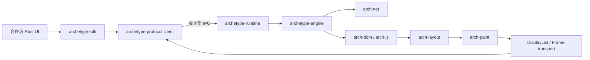

# Archetype Rust SDK 与 Runtime 详细设计

| 项 | 内容 |
|----|------|
| 规范号 | 04 |
| 对应 PRD | [04-Archetype-Rust-SDK与Runtime-PRD.md](../prd/04-Archetype-Rust-SDK与Runtime-PRD.md) |
| 版本 | SDK/Runtime 长期架构 |
| 状态 | 规划基线，ADR 完成后实施 |
| 日期 | 2026-08-14 |

---

## 1. 架构原则

- 合作方必须使用 Rust，但 Rust 类型便利性不能替代稳定的进程协议。
- `archetype-sdk` 是合作方唯一直接依赖的公开 crate。
- `archetype-runtime` 是独立进程；不交付供合作方动态调用的 Rust `dylib`。
- 公共 API、IPC 和持久化格式分别版本化，不共享内部结构体布局。
- GPUI 只存在于 Archetype 参考浏览器，不进入 SDK、协议或 Runtime 的公共边界。
- 进程隔离、操作系统沙箱和站点隔离是不同层级，必须分别实现和验证。

## 2. 目标结构

```text
crates/
├── archetype-sdk       # 合作方唯一直接依赖的公开 crate
├── archetype-types     # 稳定 ID、URL、配置、事件值类型
├── archetype-protocol  # SDK 与 Runtime 的版本化 IPC 消息
├── archetype-runtime   # 独立内核入口、进程和沙箱编排
├── archetype-engine    # 内核命令编排，不依赖具体 UI
├── arch-js
├── arch-dom
├── arch-layout
├── arch-paint
└── arch-net
```

V3 阶段不创建上述前五个新 crate 的空壳。拆分从现有 `arch-browser` 与 `BrowserCore` 的真实命令/事件边界开始，每个 crate 建立时必须有生产调用方和测试。



## 3. 公共类型规则

公共类型必须满足：自有命名空间、可序列化、无借用生命周期、无裸指针、可进行向后兼容演进。

```rust
pub struct PageId(String);
pub struct NavigationId(u64);
pub struct ArchetypeUrl(String);

pub struct Viewport {
    pub width_px: u32,
    pub height_px: u32,
    pub scale_factor: f32,
}

#[non_exhaustive]
pub enum EngineCommand {
    CreatePage(CreatePageOptions),
    Navigate { page_id: PageId, url: ArchetypeUrl },
    Resize { page_id: PageId, viewport: Viewport },
    Input { page_id: PageId, event: InputEvent },
    ClosePage { page_id: PageId },
}
```

- SDK 内部可以使用 `url::Url`、`uuid::Uuid` 等库，但公共签名不直接暴露其复杂类型。
- 枚举默认标记 `#[non_exhaustive]`；未知协议枚举值不得造成反序列化崩溃。
- 错误必须区分调用错误、协议错误、Runtime 错误、页面错误和断连。
- `FrameReady` 只携带版本化帧描述符，不暴露 GPUI、wgpu 或平台对象本身。

## 4. SDK API

目标调用模型：

```rust
let engine = Engine::builder()
    .profile_dir("./profile")
    .build()
    .await?;

let page = engine.create_page(PageOptions::default()).await?;
page.navigate("https://example.com").await?;

while let Some(event) = page.next_event().await {
    match event {
        PageEvent::TitleChanged(title) => println!("title: {title}"),
        PageEvent::FrameReady(frame) => window.present(frame),
        PageEvent::PermissionRequested(request) => request.deny().await?,
        _ => {}
    }
}
```

SDK 内部职责：

- 定位、校验并启动匹配的 Runtime。
- 完成握手并维护单调请求 ID。
- 将响应路由到等待中的 Future，将事件路由到有界队列。
- 在队列满时合并可覆盖事件，例如 resize、进度和旧帧；不得丢失权限请求和终止事件。
- Runtime 退出时完成所有等待中的 Future，并广播 `RuntimeDisconnected`。
- `Engine` drop 时先请求优雅关闭，超时后仅终止由该 SDK 实例启动的 Runtime。

## 5. IPC 协议

### 5.1 握手

```text
ClientHello {
  sdk_version,
  supported_protocol_range,
  requested_capabilities,
  client_nonce
}

ServerHello {
  runtime_version,
  selected_protocol,
  granted_capabilities,
  server_nonce,
  limits
}
```

- 握手完成前只接受握手和拒绝消息。
- Runtime 必须验证对端来源、父进程关系或一次性启动令牌。
- 主协议版本不兼容立即断开；次版本通过能力位协商。
- 每条消息包含固定头：magic、协议版本、消息种类、请求 ID、负载长度和校验字段。

### 5.2 请求与事件

- 请求必须收到成功、结构化失败或取消确认之一。
- 页面事件携带 `PageId`；导航事件额外携带 `NavigationId`。
- 旧 `NavigationId` 的帧、标题和加载完成事件由 Runtime 丢弃，SDK 再做一次防御性过滤。
- 消息最大尺寸、并发请求数、事件队列和共享内存总量由握手 limits 给出并强制执行。

### 5.3 帧传输候选

| 方案 | 优点 | 代价 | 适用阶段 |
|------|------|------|----------|
| 序列化 DisplayList | 易测试、与 V3 边界一致 | 合作方需要呈现适配，协议演进压力大 | 原型与调试 |
| 共享内存 RGBA 帧 | UI 接入简单、跨 UI 框架 | 带宽和内存成本高 | 首个通用 SDK |
| 平台 GPU 共享句柄 | 拷贝少、性能上限高 | 平台差异、同步和生命周期复杂 | 性能阶段 |

首个公开兼容版本只能选择一个必选基线；其他方案通过能力协商作为可选扩展。最终选择由 ADR 决定。

## 6. 进程与安全边界

目标长期拓扑：

```text
Partner UI
  └── archetype-runtime (Browser/Coordinator)
        ├── Network service
        ├── Renderer(site A)
        ├── Renderer(site B)
        └── GPU service
```

- 首版可合并 Network/GPU，但不得把网页 JavaScript 放回合作方 UI 进程。
- Renderer 按站点隔离策略创建，CPU、内存、句柄、文件和网络能力使用系统机制限制。
- macOS 使用 App Sandbox/seatbelt 与签名继承规则；Windows 使用 AppContainer/Job Objects；Linux 使用 namespaces、seccomp 和受限文件系统。具体组合由各平台 ADR 冻结。
- IPC 输入全部视为不可信；验证长度、范围、状态机、句柄类型和对象所有权。
- Runtime 不接受任意路径加载子进程或动态库；二进制必须经过版本与签名校验。

## 7. 生命周期与恢复

```text
NotStarted -> Starting -> Handshaking -> Ready
                                \-> Incompatible
Ready -> Disconnecting -> Stopped
Ready -> Crashed -> Restarting -> Handshaking
```

- SDK 区分正常退出、不兼容、启动失败、协议违规和崩溃。
- 自动重启必须有限次、带退避，且不自动重放权限决定、表单提交或其他非幂等命令。
- 页面恢复使用版本化会话元数据重新创建，不恢复合作方持有的内部引用。
- Runtime 崩溃报告不得包含网页正文、Cookie、密码或用户目录原始路径，除非用户明确授权。

## 8. 兼容与发布

示例兼容关系：

```text
SDK 1.x <-> Protocol v3 <-> Runtime 3.x
```

- SDK 遵循 SemVer，并声明最低支持 Rust 版本（MSRV）。
- Protocol 使用独立主/次版本；Runtime 发布物声明支持的协议区间。
- Runtime 二进制包含平台、架构、版本、构建 ID 和协议区间元数据。
- SDK 在启动前校验 Runtime 哈希/签名，拒绝未知或降级版本。
- 更新采用原子替换和可回滚目录，不覆盖正在运行的二进制。

## 9. 测试策略

- SDK 使用 fake Runtime 覆盖握手、超时、乱序响应、断连和背压。
- Protocol 对所有消息执行 round-trip、未知字段、大小限制和 fuzz 测试。
- Runtime 使用故障注入验证 Renderer 崩溃、OOM、无限循环和 IPC 中断。
- 每个平台执行签名、沙箱逃逸面、子进程继承和共享句柄生命周期测试。
- 维护 SDK/Protocol/Runtime 兼容矩阵测试，至少覆盖当前和前一个受支持协议版本。

## 10. 实施阶段

| 阶段 | 交付 | 退出条件 |
|------|------|----------|
| A 边界提取 | `archetype-types`、Engine 命令/事件，无 IPC | GPUI 不出现在边界，现有 V3 测试通过 |
| B 协议原型 | `archetype-protocol`、内存 transport、fake Runtime | fuzz 和超限测试通过 |
| C 独立 Runtime | 进程启动、握手、断连恢复、基础帧 | Runtime 被杀后 UI 存活 |
| D Renderer 隔离 | JavaScript/Renderer 子进程与平台沙箱 | 资源滥用和崩溃隔离测试通过 |
| E 公开 SDK | API 文档、示例、兼容矩阵、签名交付 | 合作方验收样例通过 |

## 11. ADR 清单

实施前至少冻结：

1. IPC transport 与编码。
2. 帧传输基线与 GPU 扩展。
3. 进程拓扑和站点隔离键。
4. 三平台沙箱与签名模型。
5. Runtime 发现、更新和回滚。
6. SDK MSRV、SemVer 与协议兼容窗口。
7. JavaScript 引擎和 Renderer 内存所有权。
8. 诊断、崩溃报告和隐私策略。

## 12. 相关文档

- [Rust SDK 与 Runtime PRD](../prd/04-Archetype-Rust-SDK与Runtime-PRD.md)
- [V3 详细设计](./03-Archetype-V3-详设.md)
- [总体详细设计](./01-Archetype-总体详设.md)

