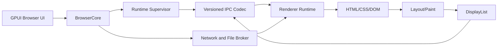

# Archetype V4 安全运行时详细设计

| 项 | 内容 |
|----|------|
| 规范号 | 05 |
| 对应 PRD | [05-Archetype-V4-安全运行时-PRD.md](../prd/05-Archetype-V4-安全运行时-PRD.md) |
| 版本 | V4 开发者预览版 |
| 状态 | 实施基线 |
| 日期 | 2026-08-24 |

---

## 1. 设计原则

- 先提取现有生产路径的真实边界，再创建协议和进程；禁止空壳 crate。
- UI、协议、持久化和 Renderer 内部类型分别版本化，不共享 Rust 结构体布局。
- Renderer、独立进程和系统沙箱是三个不同概念，验收必须分别证明。
- 所有 IPC 输入不可信；长度、版本、状态、对象所有权和队列容量必须先验证再执行。
- V4 不执行 JavaScript，先用静态内容证明隔离、broker 和恢复模型。
- GPUI 只负责参考浏览器 UI，不进入 `archetype-types` 或协议消息。

## 2. 冻结决策

| 决策 | V4 选择 | 理由 |
|------|----------|------|
| 进程拓扑 | 一个 GPUI Browser 进程与一个 Renderer Runtime 子进程 | 先证明崩溃隔离；站点级多 Renderer 延后 |
| IPC transport | 子进程 stdin/stdout 上的双向长度前缀消息 | 本地、可测试、无监听端口；后续可替换 transport |
| 编码 | 版本化 JSON envelope，最大负载 16 MiB | 易审计和 fuzz；DisplayList 当前可序列化 |
| 帧基线 | V4 内部序列化 DisplayList | 复用 V3 边界；不声明为公开长期协议 |
| 网络 | Browser broker 执行网络请求，Renderer 无直接网络权限 | 策略和 Cookie 集中执行 |
| 文件 | Browser 只传已验证文档/资源字节，Renderer 不接收任意路径 | 避免 Renderer 扩大用户文件访问面 |
| macOS 沙箱 | 签名 App Sandbox 子进程加最小 entitlement，开发态使用探针验证等价限制 | 公开发布前必须以签名产物复验 |
| JavaScript | V4 不集成 | 沙箱、权限和生命周期先稳定 |

这些决策服务于参考浏览器 V4，不替代 04 规范中公开 SDK 的长期 ADR。公开协议可以复用语义，但必须独立评审兼容窗口和帧传输。

## 3. 目标结构

```text
crates/
├── archetype-types     # 稳定 ID、命令/事件基础值对象
├── archetype-protocol  # V4 内部版本化 envelope、握手和 codec
├── archetype-runtime   # Renderer 子进程入口与命令循环
├── arch-browser        # BrowserCore、GPUI、进程监督与 broker
├── arch-session        # 导航状态机，使用 archetype-types
├── arch-net            # Browser 进程网络加载
├── arch-html / arch-css / arch-style
└── arch-layout / arch-paint
```

阶段 A 只创建 `archetype-types`，并立即由 `arch-session` 和 `arch-browser` 使用。阶段 B 只有在 envelope、协商和 codec 同时具备测试调用方时才创建 `archetype-protocol`。阶段 C 再创建有真实子进程入口的 `archetype-runtime`。



## 4. 稳定类型边界

首个切片提取：

```rust
#[serde(transparent)]
pub struct PageId(String);

#[serde(transparent)]
pub struct NavigationId(u64);
```

- `PageId` 内部使用 UUID v7 字符串，但公共字段不暴露 `uuid::Uuid`。
- `NavigationId` 只提供零值、读取和饱和递增，不允许调用方任意修改内部值。
- 两种 ID 都必须可复制或廉价克隆、可哈希、可序列化，并有 JSON 形状测试。
- `arch-session` 保持导航状态机所有权；`archetype-types` 不依赖 Session、网络或 UI。
- `Viewport` 在 Resize 协议落地时迁移，届时固定为整数物理尺寸、缩放因子和显式合法范围。

命令/事件迁移采用逐项替换：每个被提取类型必须已有生产调用方和 round-trip 测试。V4 不一次性复制整个 `BrowserCommand`，避免形成并行但无人使用的协议模型。

## 5. 协议与状态机

### 5.1 Envelope

```text
Envelope {
  magic: "ARCH",
  protocol_major: 4,
  protocol_minor: 0,
  kind,
  request_id,
  payload_length,
  payload
}
```

- 4 字节大端长度前缀只覆盖 envelope body；body 上限 16 MiB。
- 握手前仅接受 `ClientHello`、`ServerHello` 和 `Rejected`。
- `request_id` 在单连接内单调递增；`0` 只用于无请求关联的生命周期事件。
- 主版本不匹配立即拒绝；次版本通过 capability 集合协商。
- 未知可选 JSON 字段忽略，未知消息 kind 拒绝并记录协议错误。

### 5.2 首版能力

```text
static_document
display_list_v1
cancellable_navigation
resource_broker_v1
renderer_restart_v1
```

每条页面消息携带 `PageId`；导航消息额外携带 `NavigationId`。Runtime 和 BrowserCore 都丢弃旧导航结果。每连接最多 64 个未完成请求、256 个事件和 64 MiB 在途负载；超限返回结构化错误并关闭违规连接。

## 6. Runtime 监督与恢复

```text
Stopped -> Starting -> Handshaking -> Ready
                \-> Failed
Ready -> Stopping -> Stopped
Ready -> Disconnected -> Backoff -> Starting
```

- Browser 创建一次性启动令牌，通过继承管道传递，不放入命令行或日志。
- 启动和握手各限时 5 秒；连续崩溃最多自动重启 3 次，退避 100 ms、500 ms、2 s。
- Runtime 退出时，所有未完成请求以 `RuntimeDisconnected` 完成；UI 线程不得等待子进程退出。
- 仅重放幂等状态：页面 URL、视口、滚动元数据和历史。POST、权限决定和表单正文不自动重放。
- kill-loop 测试使用真实子进程，确认 UI/监督进程持续存活且无僵尸进程。

## 7. macOS 沙箱与 broker

- Renderer 不持有用户选择文件的路径，只接收有大小上限的资源字节和来源 URL。
- Renderer 禁止建立网络连接；重定向、TLS、Cookie、同源和资源上限由 Browser broker 执行。
- App Sandbox 发行配置不给 Renderer 用户文件、下载、网络 client/server 或动态库加载 entitlement。
- 每次构建运行探针：读取临时用户文件、连接 loopback/外网、创建监听端口和启动任意子进程均应失败。
- 资源监督首版限制单 Renderer RSS 512 MiB、单消息 16 MiB、在途消息 64 MiB；超限终止 Renderer 并保留本地最小诊断。

开发态无法等同签名 App Sandbox。阶段 D 退出必须同时有开发探针和签名测试产物证据，文档不得只凭进程拆分宣称安全。

### 7.1 D1 实施证据

- Browser 通过继承 stdin/stdout 交换一次性 256-bit 启动令牌；令牌不进入命令行、环境变量、日志或协议 payload。
- 监督器按 250 ms 周期采样 RSS，默认上限 512 MiB；请求默认 5 秒超时，在途编码帧默认上限 64 MiB。超时或 RSS 超限会终止并回收 Runtime。
- `config/macos/runtime.sb` 配合 `scripts/verify_runtime_sandbox.sh` 先证明探针在无沙箱时有效，再证明文件读取、loopback/外网连接、监听和任意子进程启动均以 `EPERM` 失败。
- `scripts/verify_runtime_entitlements.sh` 对 Browser 和 Runtime Mach-O 测试副本进行临时签名，读取实际嵌入的 entitlement，并对 Browser 三项权限、Runtime 两项继承权限执行精确键白名单检查。
- 上述证据由 macOS CI 每次执行。它不等同 Developer ID 签名、`.app` helper 嵌入、公证和 Gatekeeper 验收；这些生产发行门槛不进入 V4。

## 8. Cookie、表单与权限

- Cookie jar 位于 Browser 进程并按 profile 存储；Renderer 只获得经过匹配的请求结果，不获得 HttpOnly Cookie 值。
- SQLite schema 独立版本迁移，Cookie 值静态加密；密钥由 macOS Keychain 保存。
- 表单控件状态只存在于页面生命周期；密码值不写日志、会话快照或崩溃报告。
- GET 提交构造查询参数；POST 首版仅支持 `application/x-www-form-urlencoded`，且需要用户动作。
- 跨源提交、重定向和 SameSite 判断由 broker 统一执行。TLS 错误继续硬失败。

## 9. Flexbox 与休眠

- `arch-style` 增加版本化枚举：方向、换行、主轴/交叉轴对齐、grow、shrink、basis 和 gap。
- `arch-layout` 使用独立 flex formatting context；不得在现有 block 算法中堆叠条件分支。
- 至少 20 个固定 Flexbox 页面覆盖单行、多行、嵌套、溢出、中英文和图片。
- 休眠快照只保存 URL、标题、历史、视口、滚动位置和表单是否脏的布尔标记，不保存 DOM、密码或页面正文。
- 唤醒通过重新导航恢复；存在未提交表单时默认不自动休眠。

## 10. 测试与可观测性

- `archetype-types`：JSON round-trip、无效 ID、导航 ID 饱和和 API 形状测试。
- `archetype-protocol`：握手矩阵、未知字段、长度边界、乱序、背压和 fuzz。
- Runtime：真实进程启动、超时、kill-loop、崩溃退避和幂等恢复。
- 沙箱：文件、网络、端口、子进程和资源上限探针。
- Cookie/表单：确定性本地 HTTP server，不访问公网。
- Flexbox：布局树断言和固定截图回归，阈值保持 0.5%。
- 日志只记录版本、请求 ID、Page ID、Navigation ID、阶段、错误类别和资源计数；敏感值必须在写入前删除。

## 11. 实施切片

| 切片 | 代码范围 | 验证 |
|------|----------|------|
| A1 稳定 ID | 新建 `archetype-types`，迁移 `PageId`/`NavigationId` | 生产调用、round-trip、V3 全回归 |
| A2 命令事件 | 逐项迁移 Session 命令/事件值 | 无 GPUI/第三方公共类型 |
| B1 握手 codec | 新建 `archetype-protocol` | round-trip、版本和 16 MiB 边界 |
| B2 内存 transport | fake Runtime 与请求路由 | 超时、取消、乱序和背压 |
| C1 子进程 | `archetype-runtime` 静态导航 | kill-loop 和无 UI 阻塞 |
| C2 broker | 网络/文件字节传递 | Renderer 无路径/网络能力 |
| D1 沙箱 | entitlements、资源监督和探针 | 签名构建隔离证据 |
| E1 会话 | Cookie、基础表单、迁移 | 本地 HTTP 金样 |
| E2 布局 | Flex formatting context | 20 金样和截图 |
| E3 休眠 | 版本化恢复元数据 | 强退、休眠、唤醒测试 |
| F1 支持矩阵 | `docs/html-css-support.json` 与校验脚本 | 每项支持能力绑定测试证据 |
| F2 开发者发布 | 双二进制未签名 macOS 包、校验和、验收工作流 | Release 产物可复现且限制明确 |

## 12. 完成定义

V4 已按 A1 至 F2 切片完成 05 PRD 验收范围。桌面 GET/POST 均由 Browser broker 加载并交给 Runtime 渲染；Cookie 值、网络能力和源文件路径不跨入 Runtime。GitHub Release 提供同目录双二进制未签名开发包、SHA-256 校验和、支持矩阵与验收说明。生产签名、公证、自动更新和公开 SDK 稳定承诺继续由后续版本承担。

## 13. 相关文档

- [V4 安全运行时 PRD](../prd/05-Archetype-V4-安全运行时-PRD.md)
- [Rust SDK 与 Runtime 详细设计](./04-Archetype-Rust-SDK与Runtime详设.md)
- [V3 详细设计](./03-Archetype-V3-详设.md)
- [总体详细设计](./01-Archetype-总体详设.md)
